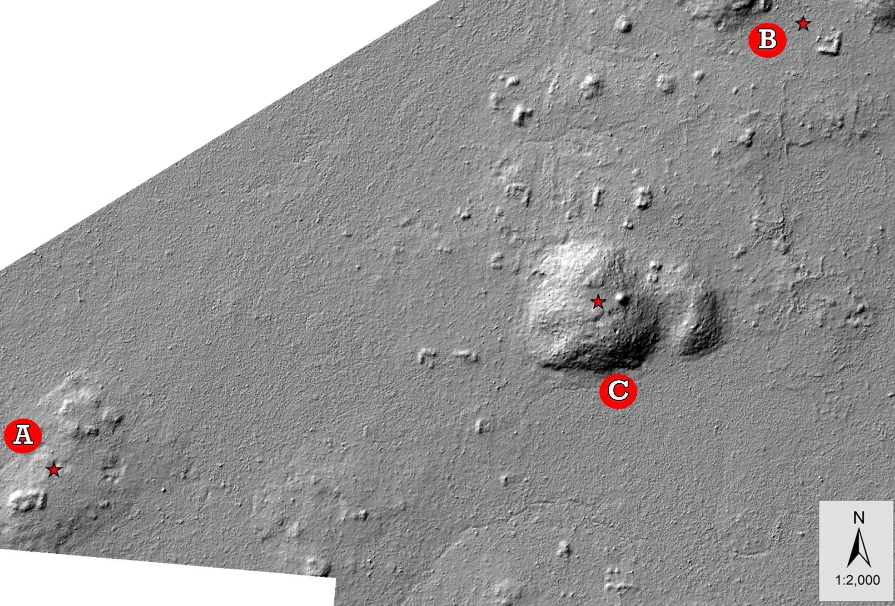

\newpage
```{r global_options, echo=FALSE, message=FALSE, warning=FALSE}
knitr::opts_chunk$set(echo = FALSE, message = FALSE, warning = FALSE, eval = TRUE)
```

```{r load-packages-and-data, message = FALSE, warning=FALSE}

# load tidyverse
library(tidyverse)
library(tidyr)

# load tinytex
library(tinytex)
# install tinytex if you haven't already using...

library(bookdown)
library(reshape2)
library(knitr)
library(kableExtra)
library(xtable)

```

```{r}
# Load Datasets
Deb <- read.csv("./datasets/DH2GC_Lithic_Analysis_Form_Debitage_2013.csv",stringsAsFactors = FALSE)
Flak <-  read.csv("./datasets/DH2GC_Lithic_Analysis_Form_Flakes_2013.csv",stringsAsFactors = FALSE)
Tls <- read.csv("./datasets/DH2GC_Lithic_Analysis_Tools_2013.csv",stringsAsFactors = FALSE)
Obs <- read.csv("./datasets/DH2GC_2013_Obsidian_Data_Needstobechecked.csv",stringsAsFactors = FALSE)

Debitage <- read.csv("./datasets/TidyData/Debitage.csv",stringsAsFactors = FALSE)
Flakes <- read.csv("./datasets/TidyData/Flakes.csv",stringsAsFactors = FALSE)
Tools <- read.csv("./datasets/TidyData/Tools.csv",stringsAsFactors = FALSE)
```

\newpage 

\section{Introduction}

Archaeological collections are often first excavated and processed with great excitement. However, as time passes, analyses are published, or a new goal for the project is set, the craze for those once excavated materials starts to fade. This causes cultural collections to sit in storage rooms at or near project sites, offsite collection rooms, or at best in well catalogued/climate controlled museum basements. The raw data used for published works remains hidden away in the boxes in someone's basement, or in storage drives in the researcher's desk, thus creating problems in the accessibility of such data. As \citet{lodwick2019} points out, perception  of data sharing and reuse is currently low among archaeologists \citep{lodwick2019}.  

Although traditional models of data access has been effective in advancing knowledge for archaeology, this model does not meet current norms of practice in the sciences \citep{marwick2017a}. The new norm is known as open science \citep{lodwick2019, marwick2017a}, which includes data stewardship, transparency, and public involvement \citep{marwick2017a}. The strong resistance to open access has been primarily due to the "potential for harm to people and cultural heritage" if data is misused \citep[p. 10]{marwick2017a}. 

As \citet{marwick2017a} discusses, however, these issues could be easily addressed. But why should this matter? Afterall, archaeology has been successful at creating and advancing knowledge. \citet{lodwick2019} and \citet{stodden2016} warn, however, that the lack of transparency has raised concerns on irreproducility. 

In archaeology, explicit discussion on data sharing has remained mainly within zooarchaeology (with works like that of Kansa and Kansa, 2013, and Atici et al., 2013; \citealt{lodwick2019}); however, some focus has been giving to lithics data. The purpose of this project will be to contribute to the discussion on lithic data sharing. This project will use four datasets that have been stored on personal storage drives. Data access to this information is currently restricted to members of the archaeological project. Analysis and publication of this data  was dated to 2014 on an interim field report. In addition, like the data, access to this report is difficult and unless a prior relationship exists between the members of the project, outside access is near impossible. 

According to \citet{marwick2017a} open science practices enable archaeologists to:
\begin{itemize}
\item Increase transparency and reproducibility.
\item Enable more ready and responsible build upon work between colleagues.
\item Accelerate discovery.
\item Enhance credibility.
\item Promote ethical research.
\item Enhance engagement between researchers and other collaborators.
\item Enhance inclusiveness. 
\end{itemize}
For this reason, the goal of this project will be to use datasets that have been inaccessible to the public and publish it on an open access repository. Ultimately, this project will touch on the seven key points brought up by \citet{marwick2017a}, advancing data stewardship practices, open access to data, and creating an opportunity to reproduce and challenge the analysis of this project.

\section{Archaeological Project Background Information} 

The data to be analyzed in this project was collected in 2013 by Dr. Marisol Cortes-Rincon and the Dos Hombres to Gran Cacao (DH2GC) archaeological field school crewmembers. The field season operates between the months of May and June every year. During this time, Dr. Cortes-Rincon leads a group of undergraduates with the assistance of returning students or 2 graduate students. The archaeological project is located in Belize, and its research area expands within a transect between two major Maya cities, Dos Hombres and Gran Cacao (Figure \@ref(fig:area)).    

```{r area,fig.cap="DH2GC Project Location [@mcfarland2019]" }
include_graphics("ProjectArea.jpg")
```

The distance between the two major cities is approximately 12km. However, the location of the 2013 field season, Figure \@ref(fig:area2), is approximately 500 (group a), 950 (group c) to 1250m (group b) - as the bird flies - from Dos Hombres. The environment near this area is composed of bajos (swamps) with some karstic hills at the far northeast of the last excavated household (b). The area is characterized by lowland vegetation, with little to no natural water sources. The nearest natural water source is approximately 2km away (or 0.5km from Dos Hombres as the bird flies). 

```{r area2,fig.cap="2013 Excavation Area. Household 1 is at A, houseld 2 at B, and minor ritual center at C"}

```


\section{Methods}

I will adopt the basic workflow provided by \citet{marwick2017b}. His workflow diagram \citep[see][fig.~1]{marwick2017b} indicated two basic key steps which enables reproductibility. First, the collection of custom R package functions, unit tests, consolidation of data in RProj, and a rendered output must all be collected in the same place. Second, research Collection (including step 1 and any manuscripts) should be stored in a GitHub repository. 

In order to achieve a high degree of reproducibility (as that set by \citealt{marwick2017b}), the repository files will include: a copy of this project paper, text files of raw data, script files of R, and a dockerfile that includes computational environments. GitHub will be used as the repository of the preceding files. 

\subsection{Data Tidying} 

As indicated by \citet{wickham2014} most of the time in data analysis is spent in cleaning and preparing the data. Further, data preparation is not only the first step, but a revisited process throughout the analysis \citep{wickham2014}. Datasets used for this project (Table \@ref(fig:debipreview),\@ref(fig:flakpreview),\@ref(fig:toolpreview), and \@ref(fig:obspreview)) were never intended for the purposes of computational analysis. Therefore, the datasets are expected to required heavy preparation and cleaning. 

```{r debipreview}

kable(
  head(Deb[, 1:5], 6), booktabs = TRUE,
  caption = 'Preview of Archaeological Debitage Dataset [@cortes2013]')

```

```{r flakpreview}
kable(
  head(Flak[, 1:5], 6), booktabs = TRUE,
  caption = 'Preview of Archaeological Flake Dataset [@cortes2013]')
```

```{r toolpreview}

kable(
  head(Tls[, 1:7], 6), booktabs = TRUE,
  caption = 'Preview of Archaeological Tool Dataset [@cortes2013]')

```

```{r obspreview}

kable(
  head(Obs[, 1:6], 6), booktabs = TRUE,
  caption = 'Preview of Archaeological Obsidian Dataset [@cortes2013]')

```


These data sets will be subjected to data cleaning through the principles of tidy data. According to \citet{wickham2014}, tidy data provides a standard way to organize values within a dataset. In addition, this standard will facilitate initial exploration, while simpliying the development of analysis. Tidy datasets depend \textsl{on how rows, columns, and tables are matched up with observations, variables and types. In tidy data:}
\begin{enumerate}
\item \textsl{Each variable forms a column.}
\item \textsl{Each observation forms a row.}
\item \textsl{Each type of observational unit forms a table.} \citep[p. 4]{wickham2014}
\end{enumerate} 

Lastly, in order to meet reproducibility standards as set forth by \citet{marwick2017b}, all processed datasets will be exported to a text file using the `` `write.csv()` `` function.

\subsection{Archaeology}

The data analyzed here was excavated during the 2013 field season. It was collected from two household groups (A and B in Figure \@ref(fig:area2)) and a minor ritual center (C in Figure \@ref(fig:area2)) through standard excavation techniques. Excavation untis measured 1x1m and were set up abutting the structures. Excavation units were subject to expansion if features were discovered during the excavation process (such as building corners, ritual depositions, stairs, etc). 

Household A only contained one excavation unit, 4-J. This excavation was first put in place in the 2012 field season, but was expanded and finished during the 2013 season. The unit was first proposed to find what the relationship was between the household and the minor ritual center. Household B was a newly discovered group, and was the center of attention for the mapping crew and a few excavators. Units placed here were 6-A, 6-B, 6-C, and 6-D. The minor ritual center has been subjected to various years of intense excavations. The excavations are 4-B and 4-K (causeway), 4-G and 4-O (courtyard group), 4-M and 4-N (burial), 4-S (elite housing/other ritual building), 4-T (cave/xultun).

Excavated soil for each unit was screened through a 1cm mesh and stored in cloth bags for later processing. All of the excavated artifacts were processed and analyzed towards the latter end of the project by a group of students and volunteers. Artifactual recordings were analyzed through standard procedures as that set forth previously by the project. Specific lithic artifact  information can be seen in the \ref{lithics} section.  

\subsection{Lithic Analysis}
\label{lithics}

Due to the lack of a full time lithic analyst in the DH2GC project, the principle investigator adopts an expedient method in lithic analysis. Debris is separated into two categories \textbf{debitage} and \textbf{flakes}. The only attribute to separate these categories is the presence of a flake attributes: platform, bulb of percussion, and ripples. For example, if an object does not contain a recognizable attribute the artifact is labeled as debitage, while the presence of any attribute the object is labeled as a flake.

The \textbf{debitage} dataset, (table 1), follows the Flake Aggregate Analysis methodology. This method gives attention to batches of lithic debris rather than individual artifacts \citep{ahler1989}. Debris groups were organized by size-grade. However, this group sizes were not standardized. Instead, researchers grouped objects based on visual size similarities. Variables recorded for each group category were as follows:
\begin{enumerate}
\item Artifact Number: a unique number assigned to all artifacts found on the project
\item Provinience: a string that contains horizontal and vertical location information. Each excavation is broken down into three parts - Operation (group of excavation units within a vicinity), suboperation (a unique letter assigned to an excavation unit), and lot number (vertical level number, where 0 indicates top soil and increases if a change in strata or a feature is found during the excavation).
\item Count.
\item Mass (g). 
\item Average length (mm).
\item Analyst: person(s) in charged of analyzing data.
\item Comments: any noted observation. Usually involving material and/or cortex presense.   
\end{enumerate}

On the other hand, the \textbf{flake} dataset, (table 2), individual objects received more attention. Variables recorded for this type of artifact were:
\begin{enumerate}
\item Artifact Number.  
\item Provinience.
\item Dimensions: Lenght (mm), width (mm),  thickness (mm), and bulb Thickness (mm).
\item Mass (g).
\item Material type and Quality.
\item Cortex Presence: 0%, \leq 50%, \geq 50%, or 100%.
\item Platform: flat, cortical, abraded, or complex.
\item Termination: feathered, stepped, hindged, and overshot
\item Analyst.
\item Comments.   
\end{enumerate}

Lastly the \textbf{tools} and \textbf{obsidian} datasets received special attention. Data recorded for tools are:

\begin{enumerate}
\item Artifact Number.
\item Provinience.
\item Code and Code Name: Type of tool or finished product
\item Dimensions: Lenght (mm), thickness (mm), width (mm).
\item Mass (g).
\item Material type and Quality.
\item Comments.
\end{enumerate}

Obsidian data recorded:
\begin{enumerate}
\item Artifact Number.
\item Provinience.
\item Dimensions: Lenght (mm), thickness (mm), width (mm).
\item Mass (g).
\item Wear: nicking, slight, dorsal, ventral, trimming, and miscellaneous.
\item Platform: Single facet, mutiple facet, abraded single facet, ground single facet.
\item Type: the type of technology.
\item Category: Lithic form.
\item Form: Flake orientation.
\item Color.
\item Comments.
\item Researcher.
\end{enumerate}

\section{Results}
\subsection{Tidy Data}
All datasets were considered messy and met one or more problems according to \citet{wickham2014} common problems of messy datasets. Recalling the debitage data (table 1), comments contained a two types of information in most of its observations, meeting the \textit{multiple variables stored in one column} problem. Therefore, in order to bring the debitage dataset to a tidy dataset, three more variables were added. First, flake category (category) indicates the stage in the reduction sequence of the lithic assemblage; where a value of 1 are cortication flakes, and a value of 0 are cortex-free flakes

Second, a material variable was added. Lastly, the material quaility was added. Furthermore, because this data was recorded on an excel sheet, there were extra rows that did not contain any data information. This presented two problems - incorrect data type of variables and blank rows that do not provide any data information. These rows were deleted and variable names were renamed using the `` `rename()` `` function. Data types were fixed using the `` `mutate() ` `` function from tidyverse. The resulting tidy dataset was exported to a csv file named "Debitage.csv" (table 5).

```{r Debitagepreview}
kable(
  head(Debitage[, 1:7], 6), booktabs = TRUE,
  caption = ' Preview of Tidy Dataset for the Debitage Database ')
```


The flake dataset was more tidy than that of the debitage. However, it was not free of problems. The flake dataset can still be categorized as messy because it meets the \textit{multiple types of observational units stored in the same table}. Comments were scanned with the use of regular expressions, and with aid of if-statements, flakes that contained any wear or retouch should be considered tools and were filtered out from the dataset. The resulting tidy dataset was exported "Flake.csv" (table 6).

```{r Flakepreview}
kable(
  head(Flakes[, 1:7], 6), booktabs = TRUE,
  caption = ' Preview of Tidy Dataset for the Flake Databaset ')
```

The tool dataset could be considered tidy. However, because the flake dataset contained observations that should have been within the tool dataset, we considered it messy. The adoption of SQL naming convention made it relatively easy to join observations (table 7) from the flake dataset into the tool dataset. Other cleaning involved the deletion of symbols (eg, question marks) within values. The resulting tidy dataset was exported to "Tools.csv" (table 8) 

```{r Toolspreview}
kable(
  head(Tools[, 1:7], 6), booktabs = TRUE,
  caption = ' Preview of Tidy Dataset for the Tools Database ')
```

The obsidian dataset was the most difficult to work with. This dataset contained \textit{multiple types of observational units stored in the same table}; consequently leading it to have \textit{multiple variables stored in one column} and some \textit{variables stored in both rows and columns}. This dataset is composed of both tools and flake information of one single material - obsidian. For the purposes of this project, there was not any need to keep this as a stand alone dataset. Therefore, variables were added to match both the tools and flake datasets. Values were populated with the matching observation. Then, matching observations were joined to their respective dataset. 

\subsection{Lithic Analysis} 
\subsubsection{Household A}
Household A show variability in lithic material with access to both chert and obsidian. In lots 4, 5, and 6 of unit 4-J we see a large quantity of finished obsidian tools, while no chert tools (Figure \@ref(fig:Atool)). The pattern persists when comparing flakes, with a small presence of chert flakes (Figure \@ref(fig:Aflak) ), however. On the other hand, we see lot of uncategorized debitage (Figure \@ref(fig:Adebi)). 


```{r percentfunction}
proportion <- function(x,y){
  p <- y / x
  return(p)
}
```

```{r Atool,fig.cap="Tools found in Household A excavations by lot",fig.width=8,fig.asp=1.2}

Tools %>% 
  select(Operation,Suboperation,Lot,Raw_material) %>%
  filter(Operation==4, Suboperation=="J") %>%
  group_by(Suboperation,Lot,Raw_material) %>% 
  summarise(Totalcount=sum(n())) %>% 
  ggplot(aes(Raw_material,Totalcount))+
  geom_bar(aes(fill=Raw_material),
           stat = "identity",
           position = "dodge",
           colour = "black")+
  facet_wrap(~Lot, ncol = 1)+
  theme(axis.text.x = element_text(angle = 45, hjust = 1))+
  theme_classic()+
  labs(x="Raw Material",
       y="Quantity",
       fill="Raw Material")
```

```{r Aflak, fig.cap="Flake Material found in Household A excavations by lot",fig.hold='hold',out.height="90%"}
Flakes %>% 
  select(Operation,Suboperation,Lot,Raw_material) %>%
  filter(Operation==4, Suboperation=="J") %>%
  group_by(Suboperation,Lot,Raw_material) %>% 
  summarise(Totalcount=sum(n())) %>% 
  ggplot(aes(Raw_material,Totalcount))+
  geom_bar(aes(fill=Raw_material),
           stat = "identity",
           colour = "black")+
  facet_wrap(~Lot, ncol = 1)+
  theme(axis.text.x = element_text(angle = 45, hjust = 1))+
  theme_classic()+
  labs(x="Raw Material",y="Quantity")
```

```{r Adebi, fig.cap="Debitage found in Household A excavations by lot",out.width="90%"}
Debitage %>% 
  select(Operation,Suboperation,Lot,Count,Raw_material) %>%
  filter(Operation==4, Suboperation=="J") %>%
  group_by(Suboperation,Lot,Raw_material) %>% 
  summarise(Totalcount=sum(Count)) %>% 
  ggplot(aes(Raw_material,Totalcount))+
  geom_bar(stat = "identity",colour = "black")+
  facet_wrap(~Lot, ncol = 1)+
  theme(axis.text.x = element_text(angle = 45, hjust = 1))+
  theme_classic()+
  labs(x="Raw Material",y="Quantity")
```

Household A had no lithic debri with cortex (Figure \@ref(fig:Acortex)). Although, Lot 2 of unit 4-J shows that only 30% of lithic debri contained no cortex, this can be ommitted. There was an issue with the code which prevented an incorrect calculation. 

```{r Acortex, fig.cap="Frequency of Cortication and non Cortication debitage in Household A",out.width="90%"}
Debitage %>% 
  select(Operation,Suboperation,Lot,
         Raw_material,Category,Count) %>% 
  filter(Operation %in% c(4),Suboperation %in% c("J")) %>% 
  group_by(Operation,Suboperation,Lot) %>% 
  mutate(Totaldebris=sum(Count),
         Freq=proportion(Totaldebris,Count)) %>% 
  select(c(1:4),Totaldebris,Freq,Category) %>% 
  ggplot(aes(Raw_material,Freq)) + 
  geom_bar(aes(fill=Category),
           stat = "identity",
           position = "dodge",
           colour="black")+
  facet_wrap(~Lot)+
  theme_classic()+
  theme(legend.position = "none")+
  labs(x="Raw Material",
       y="Freqency")
```
\newpage
\subsubsection{Household B}

This household experience less quantities of obsidian material and an increase in chert material. Although, some obsidian tools, Figure \@ref(fig:Btool), can be found in  4-B lots 3 and 5, and some in 4-D lot 6, no flakes (Figure \@ref(fig:Bflak)) or debitage (Figure \@ref(fig:Bdebi)) were present here. Instead, we see concentrations of chert debitage and flakes. This area contained, however, some limestone flakes in units 4-B lot 4 and 4-D Lot 5 (Figure \@ref(fig:Bflak)). 

```{r Btool, fig.cap="Tools found in Household B excavations", fig.height=8, fig.asp=1.2}
b <- c("B","C","D")

Tools %>% 
  select(Operation,Suboperation,Lot,Raw_material) %>%
  filter(Operation==6, Suboperation %in% b) %>%
  group_by(Suboperation,Lot,Raw_material) %>% 
  summarise(Totalcount=sum(n())) %>% 
  ggplot(aes(Raw_material,Totalcount))+
  geom_bar(aes(fill=Raw_material),
           stat = "identity",
           position = "dodge",
           colour = "black")+
  facet_grid(rows=vars(Lot),cols=vars(Suboperation))+
  theme(axis.text.x = element_text(angle = 45, hjust = 1))+
  theme_grey()+
  labs(x="Raw Material",y="Quantity",fill="Raw Material")
```

```{r Bflak, fig.cap="Flake Material found in Household B excavations",fig.height=5,fig.asp=1}

Flakes %>% 
  select(Operation,Suboperation,Lot,Raw_material) %>%
  filter(Operation==6, Suboperation %in% b) %>%
  group_by(Suboperation,Lot,Raw_material) %>% 
  summarise(Totalcount=sum(n())) %>% 
  ggplot(aes(Raw_material,Totalcount))+
  geom_bar(aes(fill=Raw_material),
           stat = "identity",
           colour = "black")+
  facet_grid(rows=vars(Lot),cols=vars(Suboperation))+
  theme(axis.text.x = element_text(angle = 45, hjust = 1))+
  theme_grey()+
  labs(x="Raw Material",y="Quantity",fill="Raw Material")
```

```{r Bdebi,fig.cap="Debitage found in Household A excavations",fig.hold='hold',out.width="90%"}
Debitage %>% 
  select(Operation,Suboperation,Lot,Count,Raw_material) %>%
  filter(Operation==6, Suboperation %in% b) %>%
  group_by(Suboperation,Lot,Raw_material) %>% 
  summarise(Totalcount=sum(Count)) %>% 
  ggplot(aes(Raw_material,Totalcount))+
  geom_bar(aes(fill=Raw_material),
           stat = "identity",
           colour = "black")+
  facet_grid(rows=vars(Lot),cols=vars(Suboperation))+
  theme(axis.text.x = element_text(angle = 45, hjust = 1))+
  theme_grey()+
  labs(x="Raw Material",y="Quantity",fill="Raw Material")
```

For houseldhold group B, only unit 6-B at lot 4 was found to have any lithic debris with cortex (Figure \@ref(fig:Bcortex)). All other units were found to have no cortex.

```{r Bcortex, fig.cap="Frequency of Cortication and non Cortication debitage in Household B"}

Debitage %>% 
  select(Operation,Suboperation,Lot,
         Raw_material,Category,Count) %>% 
  group_by(Operation,Suboperation,Lot) %>% 
  mutate(Totaldebris=sum(Count),
         Freq=proportion(Totaldebris,Count)) %>% 
  select(c(1:4),Totaldebris,Freq,Category) %>% 
  filter(Operation %in% c(6),
         Suboperation %in% c("A","B","D"))  %>%
  ggplot(aes(Raw_material,Freq)) + 
  geom_bar(aes(fill=Category),
           stat = "identity",
           position = "dodge",
           colour="black")+
  facet_grid(rows = vars(Lot),cols = vars(Suboperation))
  
```
\newpage
\subsubsection{Minor Ritual Center}
It comes to no surprise that this area contains high concentrations of finished tools (Figure \@ref(fig:Ctool)). Surprisingly, however, there are very few obsidian tools. Only Units 4-N and 4-G, Lots 3 and 4 (respectively) had obsidian tools. Lithic debris was mostly composed of chert (Figure \@ref(fig:Cflak) and \@ref(fig:Cdebi)). However, some limestone lithic debris was found, specially in unit 4-G Lot 3 and unit 4-S lot 1. No obsidian lithic debris was found in this area.

```{r Ctool,fig.cap="Tools found in the minor ritual center excavations",fig.width=8,fig.asp=1.2}
c <- c("B","K","G","O","M","N","S","T")
  
Tools %>% 
  select(Operation,Suboperation,Lot,Raw_material) %>%
  filter(Operation==4, Suboperation %in% c) %>%
  group_by(Suboperation,Lot,Raw_material) %>% 
  summarise(Totalcount=sum(n())) %>% 
  ggplot(aes(Raw_material,Totalcount))+
  geom_bar(aes(fill=Raw_material),
           stat = "identity",
           position = "dodge",
           colour = "black")+
  facet_grid(rows=vars(Lot),cols=vars(Suboperation))+
  theme(axis.text.x = element_text(angle = 45, hjust = 1))+
  theme_grey()+
  labs(x="Raw Material",y="Quantity",fill="Raw Material")

```

```{r Cflak, fig.cap="Flakes found in the minor ritual center excavations",fig.width=8,fig.asp=1.2}
Flakes %>% 
  select(Operation,Suboperation,Lot,Raw_material) %>%
  filter(Operation==4, Suboperation %in% c) %>%
  group_by(Suboperation,Lot,Raw_material) %>% 
  summarise(Totalcount=sum(n())) %>% 
  ggplot(aes(Raw_material,Totalcount))+
  geom_bar(aes(fill=Raw_material),
           stat = "identity",
           colour = "black")+
  facet_grid(rows=vars(Lot),cols=vars(Suboperation))+
  theme_grey()+
  labs(x="Raw Material",y="Quantity",fill="Raw Material")+
  theme(axis.text.x = element_text(angle = 45, hjust = 1))
```


```{r Cdebi, fig.cap="Debitage found in the minor ritual center excavations"}
Debitage %>% 
  select(Operation,Suboperation,Lot,Count,Raw_material) %>%
  filter(Operation==4, Suboperation %in% c) %>%
  group_by(Suboperation,Lot,Raw_material) %>% 
  summarise(Totalcount=sum(Count)) %>% 
  ggplot(aes(Raw_material,Totalcount))+
  geom_bar(aes(fill=Raw_material),
           stat = "identity",
           colour = "black")+
  facet_grid(rows=vars(Lot),cols=vars(Suboperation))+
  theme_grey()+
  labs(x="Raw Material",y="Quantity",fill="Raw Material")+
  theme(axis.text.x = element_text(angle = 45, hjust = 1))
```
\newpage
Furthermore, unsurprisingly I may add, no lithic debris was found to have any cortex (Figure \@ref(fig:Ccortex)). There was only one exception, unit 4-G at lot 3 was the only instance with approximately 25% of lithic debris with chert.

```{r Ccortex, fig.cap="Frequency of Cortication and non Cortication debitage in Minor Ritual Center" }
Debitage %>% 
  select(Operation,Suboperation,Lot,
         Raw_material,Category,Count) %>% 
  filter(Operation %in% c(4),Suboperation %in% c) %>% 
  group_by(Operation,Suboperation,Lot) %>% 
  mutate(Totaldebris=sum(Count),
         Freq=proportion(Totaldebris,Count)) %>% 
  select(c(1:4),Totaldebris,Freq,Category) %>% 
  ggplot(aes(Raw_material,Freq)) + 
  geom_bar(aes(fill=Category),
           stat = "identity",
           position = "dodge",
           colour="black")+
  facet_grid(rows = vars(Lot),cols = vars(Suboperation))+
  theme_grey()+
  theme(axis.text.x = element_text(angle = 45, hjust = 1))+
  labs(x="Raw Material",
       y="Freqency")
```

\newpage
\section{Discussion}
Household A was characterized with a majority of obsidian assamblages, with little to no chert. As oppose to Houshold A, Household B was characterized with a higher frequency of chert vs. obsidian. This can imply either specialization in raw material usage, or differntical in resources access. There is a minor complication, however. Many debitage material was not categorized or was unknown. No information was found on to the specific artifact numbers, but according to \citet{cortes2013} all debitage was chert. 

Furthermore, the minor ritual center exhibited surprising results. It was expected that this site was going to show a higher concentrations of exotic materials. However, the opposite occured. Althought, little to no obsidian was found, it is obvious that finished products are been handled near this site at higher frequencies. If \citet{cortes2013} can be trusted, the debitage found here can be from resharpening tools rather than production. 

This lack of lithic production is further exacerbated by the lack of lithic assamblages with cortex residue. This is gives us a window to the economy of the region. Although, further analysis is needed to make any conclusive remarks, we can assume that materials are coming in from outside the area in the forms of blanks (given the precenses of debris and reduction flakes). The mostlikely area this lithics originate are Colha. This site is well known for its chert and lithic productions.

\section{Conclusion}
Although researchers at DH2GC did a good job at recording true variables; the lack of standard procedures created messy datasets. Even under low observations a messy data can proove extremely cumbersome. As mention by \citet{wickham2014}, the majority of time during this analysis was spent in cleaning the data. However, once it was cleanned, it allowed for easy analysis and results opened new paths for research.

Saving all files pertaining to this project in GitHub (https://roldaj5.github.io/ANTH771_Project/), will allow transparency of my work. In addition, open access to this files will allow for someone to improve upon my work, research new questions, and allow for the preservation of this data. Adopting this open access proactice, will move archaeology to meet current science norms and the advancement of newer and better questions.

\newpage
